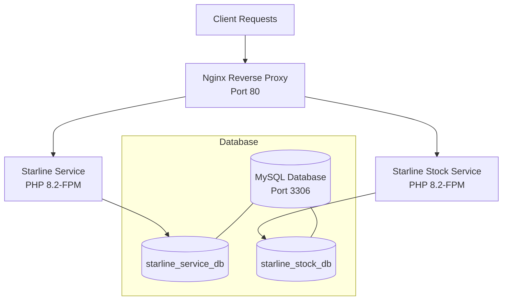
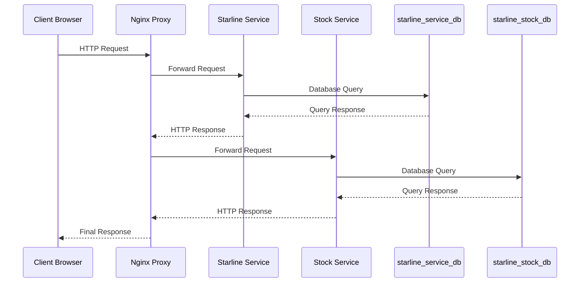
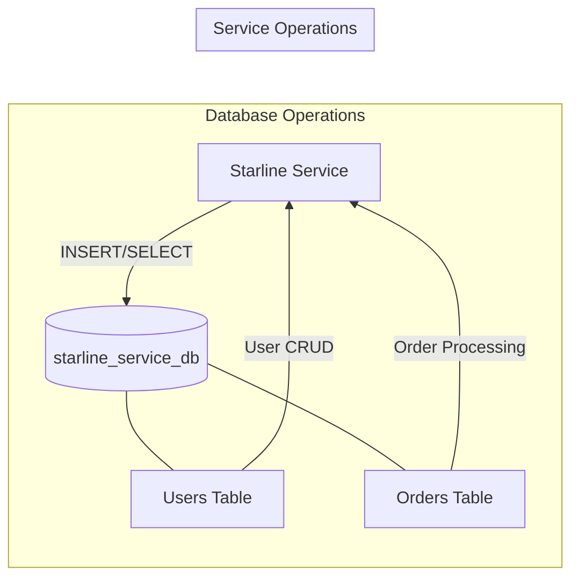
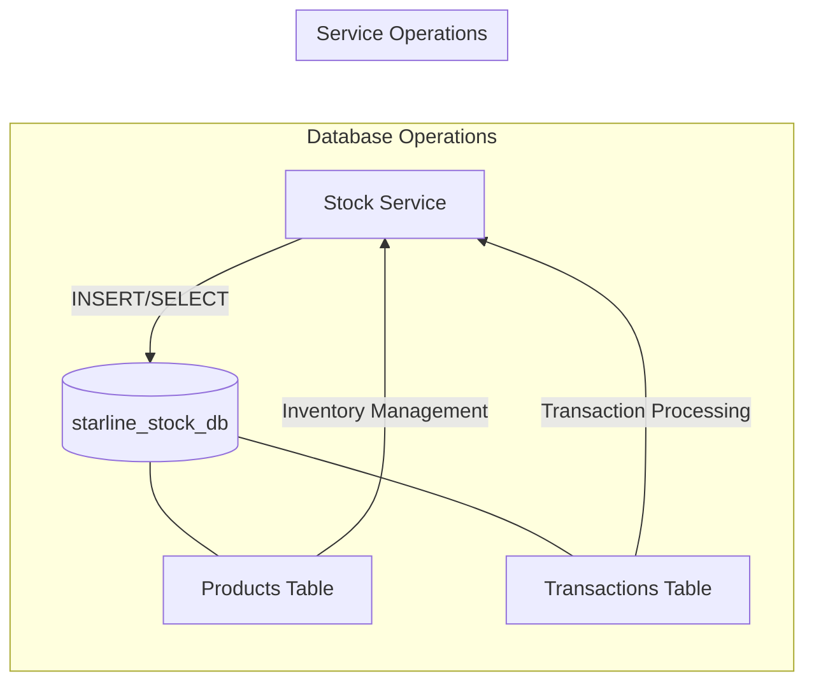
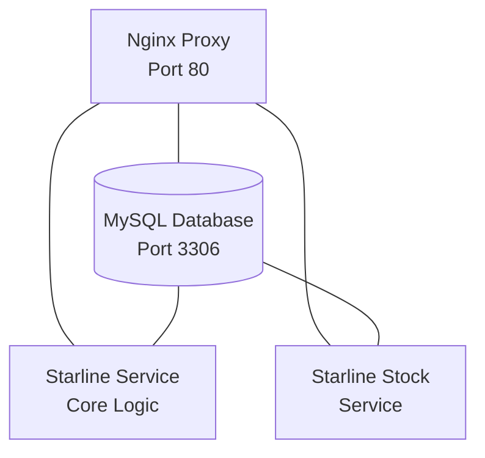

# Starline Microservices Architecture

## System Overview

The Starline microservices application is built using a distributed architecture pattern with two main services, a shared database system, and a reverse proxy for routing. The system is containerized using Docker for consistency and ease of deployment.

## Detailed System Architecture

### 1. System Architecture Diagram



### 2. Data Flow Diagram



### 3. Database Access Patterns

#### Starline Service Database Access



#### Stock Service Database Access



## Architecture Components

### 1. Service Architecture



### 2. Container Structure

- **Nginx Container (nginx)**
  - Acts as reverse proxy
  - Routes requests to appropriate services
  - Handles load balancing
  - Exposes port 80 for HTTP traffic

- **MySQL Container (mysql)**
  - Runs MySQL 5.7
  - Hosts two databases:
    - starline_service_db
    - starline_stock_db
  - Persists data using Docker volumes

- **Starline Service Container (starline)**
  - Core business logic service
  - User management
  - Order processing
  - PHP 8.2 with FPM

- **Starline Stock Service Container (starline-stock)**
  - Inventory management service
  - Stock tracking
  - Transaction processing
  - PHP 8.2 with FPM

### 3. Database Architecture

#### Starline Service Database (starline_service_db)
```sql
users
├── id (PK)
├── name
├── email (UNIQUE)
└── created_at

orders
├── id (PK)
├── user_id (FK -> users.id)
├── product_name
└── order_date
```

#### Stock Service Database (starline_stock_db)
```sql
products
├── id (PK)
├── name
├── price
├── stock
└── created_at

transactions
├── id (PK)
├── product_id (FK -> products.id)
├── quantity
└── transaction_date
```

## Communication Patterns

### 1. Service Communication
- Services communicate through REST APIs
- Nginx routes requests based on URL paths:
  - `/starline/*` → Starline Service
  - `/starline-stock/*` → Stock Service

### 2. Database Access
- Each service has its own database schema
- Services maintain their own database connections
- No cross-service database access for maintaining independence

### 3. Network Configuration
- All services run on `starline-network` Docker network
- Internal service discovery using Docker DNS
- Database accessed via `mysql` hostname

## Security Architecture

### 1. Network Security
- Services isolated in Docker network
- Only Nginx container exposes external ports
- Database accessible only within Docker network

### 2. Data Security
- Database credentials managed via environment variables
- Separate database users for each service
- Data persistence through Docker volumes

### 3. Application Security
- Services run as non-root user (www-data)
- PHP-FPM configuration optimized for security
- Input validation at service boundaries

## Scaling Considerations

### 1. Horizontal Scaling
- Services can be scaled independently
- Nginx can load balance multiple service instances
- Database can be clustered for high availability

### 2. Data Partitioning
- Database designed for potential sharding
- Services maintain separate data stores
- Minimal cross-service data dependencies

## Monitoring and Logging

### 1. Application Monitoring
- Health check endpoints (/test.php) for each service
- Docker health checks configured
- Nginx access and error logging enabled

### 2. Log Management
- Centralized logging through Docker
- Debug-level logging in development
- Structured logging format

## Deployment Architecture

### 1. Container Orchestration
- Docker Compose for development
- Services configured for easy scaling
- Environment-specific configurations via .env

### 2. Data Management
- Database initialization through init.sql
- Volume mapping for persistence
- Backup-ready configuration

## Future Considerations

### 1. Potential Improvements
- Implementation of service discovery
- Message queue for asynchronous operations
- Caching layer for performance optimization

### 2. Scalability Enhancements
- Database read replicas
- Service mesh implementation
- API gateway integration

### 3. Monitoring Enhancements
- Metrics collection
- Distributed tracing
- Automated alerting system